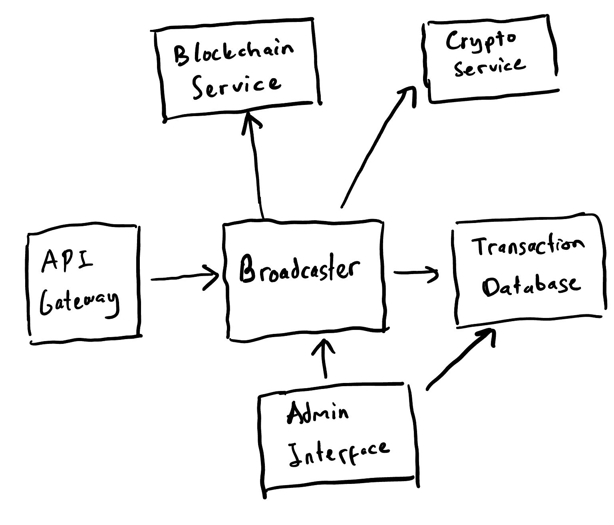

## System Design for Transaction Broadcaster Service

### Components
- API Gateway
- Broadcaster
- Transaction Database
- Admin Interface
- Crypto Service
- Blockchain Network (Assume that it already exists)



### API Gateway
This component is responsible for three jobs, which are:
- Receives the POST request to `/transaction/broadcast`
- Validates the incoming broadcast request
- Sends the request to the `Broadcaster` for further execution

Given below is the sample pseudocode for this component.
```python
class APIGateway:
    def handleBroadcastRequest(request: Request) -> HTTPResponse:
        # Check if the request is valid
        if not validateRequest(request):
            return HTTPResponse(4xx, "Invalid request")
        
        response = Broadcaster.executeTransaction(request)
        return response

    def validateRequest(request: Request) -> bool:
        # Return true if the request is valid 
        # i.e. message_type and data field must exists, etc.
```

### Broadcaster
This is the primary component of our service. When receiving the request from API Gateway, it will do the following steps:
- Insert the request to Transaction Database, and get the corresponding Id for it. This way, we can still retrieve the transactions, even if it will fail in the very next step (signing).
- Sign the data using Crypto Service functionality.
- Update the database with the signed transaction.
- Call the `broadcastTransaction()` method.

When we want to rebroadcast, either `broadcastTransaction()` or `signAndBroadcastTransaction()` method will be executed (see the `AdminInterface` pseudocode for more details).

To handle unexpected restart of service, we also have the `onRestart()` method. This function will retrieve all the ongoing requests from the Database and rebroadcast it.
```python
class TransactionBroadcaster:
    # This is the primary method that will be called by API Gateway
    def executeTransaction(request: Request) -> HTTPResponse:
        # Need to store the request to database first
        transactionId, err = TransactionDatabase
            .insertRequest(request)
        if err != None:
            return HTTPRequest(4xx, "Couldn't connect to database")

        # Need to sign the request first
        signedTransaction, err = CryptoService.sign(request.data)
        if err != None:
            return HTTPResponse(4xx, "Signing failed")

        # Need to update the database
        err = TransactionDatabase.insertSignedTransaction(
            transactionId,signedTransaction)
        if err != None:
            return HTTPResponse(4xx, "Couldn't connect to database")

        # This method will return immediately, as it's asynchronous
        broadcastTransaction(transactionId, signedTransaction)
        
        return HTTPResponse(200, "Transaction success")

    # This method will be used a lot by the Broadcaster service.
    # This pseudocode is a very naive approach to do this.
    # See details below the pseudocode for a more complex approach.
    async def broadcastTransaction(transactionId, signedTransaction: str):
        while True:
            response = Blockchain.makeRPCRequest(signedTransaction)
            
            if response.status == 200:
                TransactionDatabase.updateTransactionStatus(
                    transactionId, "success")
                break
            else:
                # sleep for a bit, before retry RPC request
                sleep(2)

    # This method will be used when we want to retry 
    # the transaction with "failed" status
    def signAndBroadcastTransaction(transactionId, 
        data: Request.data) -> HTTPResponse:

        signedTransaction, err = Crypto.sign(data)
        if err != None:
            return HTTPResponse(4xx, "Signing failed")

        # Need to update the database
        err = TransactionDatabase.insertSignedTransaction(
            transactionId, signedTransaction)
        if err != None:
            return HTTPResponse(4xx, "Couldn't connect to database")

        # This method will return immediately, as it's asynchronous
        broadcastTransaction(transactionId, signedTransaction)
        
        return HTTPResponse(200, "Transaction success")

    # method to be called when the broadcaster restarts unexpectedly
    def onRestart():
        failedRequests = database.retrieveOngoingTransactions()

        # can use parallel programming to make the execution faster
        # for instance, use python multiprocessing module etc.
        for req in failedRequests:
            broadcastTransaction(req.id, req.signed_transaction)
```

Note that in the pseudocode above, `broadcastTransaction()` is written in a very naive approach, where it will keep creating RPC Request until successful.

Instead, we can replace the `broadcastTransaction()` with a more sophisticated approach where the following properties are satisfied:
- This function must be an asynchronous method. 
- This function needs to be synchronized. More specifically, `broadcastTransaction()` needs to stop when other execution of this method with identical input returns successfully. To do this, we can probably utilize the TransactionDatabase and use some kind of mutex.
- In 95% of the time, RPC Request will return a success code within 30s. Hence, it's probably better if we limit the number of retries to 3 with ~40s allocated for each retry, instead of giving unlimited retries. The probability that all 3 retries will fail is around 0.01%, very small.

### TransactionDatabase
This component will act as the database for the previous transactions. It also provides persistence of transaction information across service restarts.

Each transaction details in the database include `id`, `message_type`, `data`, `signed_transaction`, `status`, etc. We allow three possible `status`, they are:
- "fail": If the request returns HTTP 4xx-5xx. 
- "ongoing": If the request returns HTTP 200 and the transaction has not yet broadcasted successfully.
- "success": If the request returns HTTP 200 and the transaction has been broadcasted successfully.

```python
class TransactionDatabase:
    def retrievePreviousTransactions() -> 
        Tuple[List[Transaction], Error]:
        # Returns the previous transactions.

    def retrieveOngoingTransactions() -> 
        Tuple[List[Transaction], Error]:
        # Returns the previous transactions with "ongoing" status.
        # This method is used when unexpected restart happens and
        # we need to retry all "ongoing" broadcasts
    
    def retrieveTransaction(transactionId: uint64) -> 
        Tuple[Transaction, Error]:
        # Returns the transaction with given Id

    def insertRequest(request: Request) -> Tuple[uint64, Error]:
        # Given a request, insert it to the database. 
        # It will return the transaction Id.
        # The default status is "fail".

    def insertSignedTransaction(transactionId: uint64, 
        signedTransaction: str) -> Error:
        # Insert the signed transaction to the database entry which 
        # corresponds to the transaction Id.
        # This will also update the status to "ongoing"

    def updateTransactionStatus(transactionId: uint64, 
        status: Transaction.status) -> Error:
        # Update the status of transaction with given Id

```

### Admin Interface
This component is basically the UI for admin. It is responsible for two jobs:
- Allows administrators to view a list of transactions with their statuses.
- Provides the functionality to manually retry failed transactions.

```python
class AdminInterface:
    # View list of transactions with their statuses
    def getTransactionHistory() -> List[Transaction]:
        # Retrieve data from Transaction Database
        transactionHistory, _ = TransactionDatabase
            .retrievePreviousTransaction()

        return transactionHistory

    def retryBroadcast(transactionId: uint64) -> HTTPResponse:
        # Retrieve failed transaction details from the database
        transaction = Database.retrieveTransaction(transactionId)

        if transaction is None:
            # transactionId not found in the database
            return HTTPResponse(4xx, "Invalid transaction ID")

        if transaction.status == "failed":
            response = Broadcaster.signAndBroadcastTransaction(
                transaction.id, transaction.data)

            return response

        elif transaction.status == "ongoing":
            Broadcaster.broadcastTransaction(
                transaction.id, transaction.signed_transaction)

            return HTTPResponse(200, "Transaction success")
        else:
            # Transaction is already successful
            return HTTPResponse(4xx, "Broadcast can't be retried")

```

### Crypto Service
This component is responsible for cryptography-related jobs. This may includes:
- Securely signs data
- Retrieves the private key, etc.